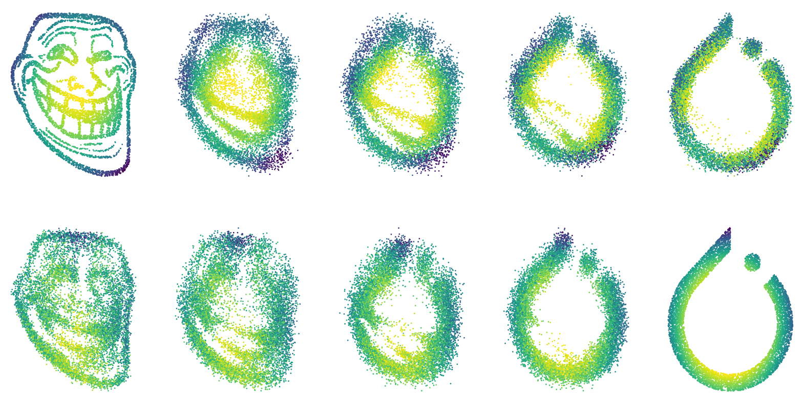

# Study of Diffusion Schrödinger Bridge model in Gaussian case


<p style="text-align: center; font-style: italic">SB between two 2D distributions after L = 20 DSB iterations. The upper half is the forward process and the lower half is the reverse process. The x axis accounts for the time steps k.</p>
<br>

This repository contains the implementation of Diffusion Schrödinger Bridge as proposed by <a href="https://arxiv.org/abs/2106.01357">De Bortoli</a>. Three branches coexist:

* **main** for 2d distributions (e.g. figure above)
* **image-only** for image distributions (e.g. MNIST)
* **gaussian** for Gaussian experiments (most used in this paper)


## Table of contents
- [Introduction](#introduction)
- [Report](#report)
- [How to run an experiment](#how-to-run-an-experiment)
- [Distributed Training](#distributed-training)
- [File structure](#file-structure)


## Introduction
Schrödinger Bridges (SB) generalize Optimal Transport by specifying not *where* but *how* to transport mass from one distribution to another, given a reference dynamic. Generative modeling can be achieved by finding SBs to go from $p_\text{prior}$ to $p_\text{data}$, which amounts to solving a *dynamic* SB problem. <a href="https://arxiv.org/abs/2106.01357">De Bortoli et al.</a> introduced the Diffusion Schrödinger Bridge (DSB) model, a variational approach to the Iterative Proportional Fitting (IPF) algorithm to solve the *discrete dynamic* SB problem. DSB generalizes score-based generative modeling (SGM) introduced by <a href="https://arxiv.org/abs/2011.13456">Song et al.</a>, and has stronger theoretical guarantees, in particular $p_T=p_\text{prior}$. This paper constitutes a theoretical and practical introduction to DSB. Our contribution is to explicit the closed-form solution of the \textit{discrete dynamic} SB problem in the Gaussian case, and leverage this closed-form expression to assess the performance of the DSB model in various settings by varying the dimension and complexity of $p_\text{data}$ and $p_\text{prior}$. In particular, we demonstrate that setting $L=20$ DSB iterations as in the original paper amounts to under-training the DSB model.

## Report
The report of this study is available [here](report/report.pdf) and details the mathematical background of the DSB model, the closed-form solution of the discrete dynamic SB problem in the Gaussian case, and the results of our experiments.

## How to run an experiment
0. Install the required packages by running ```pip install -r requirements.txt```.
1. Select the appropriate branch depending on your use case.
2. Run ```python main.py``` with your choice of arguments to fit the DSB model.
3. Access the **experiment folder** which contains a config file (```config.yaml```), a log file (```train.log```) and the model weights in (```weights/```). If you set the flag ```--use_ema```, the EMA weights will be stored in ```weights_EMA/```.
4. Generate data using the various functions in ```utils.py``` or by calling DSB's own methods !

## Distributed Training (sweeps)
To distribute training across several SSH hosts to run sweeps of experiments, follow these steps:

0. [Setup]
    * List all your SSH hosts (format each line as "{Host IP} {Host Name}") in a `hosts.txt` file.
    * Create an empty `used_hosts.txt` file.
    * Create a `secret.py` file containing your SSH username `USER` and password `PSWD` as well as the directory where your source code is stored `PROJECT_DIR`.
1. Create a folder ```sweep_dir``` (or any name of your choice) and fill it with several initial **experiment folders** by calling ```python main.py --config_only``` with your choice of arguments for each experiment you wish to add to the sweep OR Use `utils.create_sweep` (branch **gaussian** only).
2. Distribute your tasks to your SSH hosts using ```python distribute.py sweep_dir```.
3. Monitor progress in real-time using ```python monitor.py sweep_dir``` in another terminal.


## File structure
- `argloader.py`: Defines a function `get_args` that uses the argparse library to parse command-line arguments for training the Diffusion Schrödinger Bridge (DSB) model.
- `config.py`: Defines a function `save_config` that saves the configuration of the DSB model training process to a YAML file.
- `data.py`: Defines various classes and functions for data sampling and loading, specifically for the DSB model.
- `distribute.py`: Distributes tasks for running experiments on multiple hosts using the Fabric library.
- `ema.py`: Defines a class `EMA` (Exponential Moving Average) for maintaining a moving average of model parameters.
- `logloader.py`: Sets up a logging system with both console and file handlers.
- `main.py`: Serves as the entry point for training the DSB model, parsing command-line arguments, setting up logging, and initializing the training process.
- `models.py`: Defines the Cached Diffusion Schrödinger Bridge (DSB) model as proposed by De Bortoli et al.
- `monitor.py`: Monitors the progress of experiments in a specified sweep directory.
- `utils.py`: Provides utility functions for visualizing the Diffusion Schrödinger Bridge (DSB) model.
- the `assets/` directory contains images and other assets used in the README.